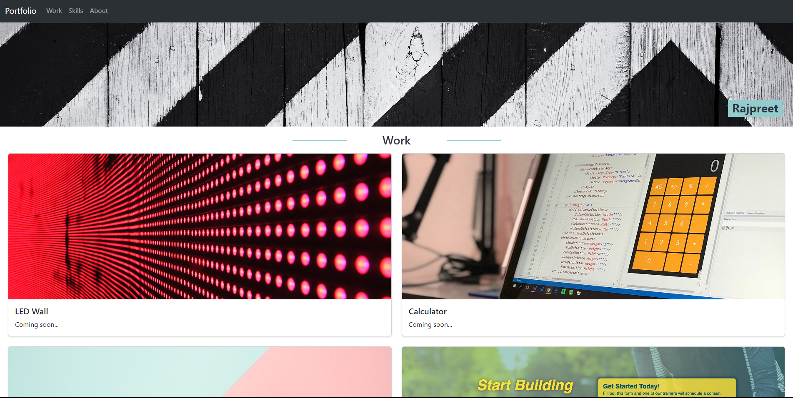

# Bootstrap Portfolio

## Description
This is a challenge I did for my bootcamp. I was tasked to recreate my protfolio from the second challenge using bootstrap. In this project, I utilised bootstrap and the resources available on it to recreate, modify and improve on the portfolio I created last time.

## Screenshot

## Live
Link: https://rajpreetkr.github.io/bootstrap-portfolio

## Credits
Used the following to help me stylise and fix issues I was having when creating this:
https://unclebigbay.com/how-to-add-horizontal-lines-before-and-after-a-text-in-html
https://stackoverflow.com/questions/37287153/how-to-get-images-in-bootstraps-card-to-be-the-same-height-width
https://www.w3schools.com/howto/howto_css_cards.asp
https://forum.bootstrapstudio.io/t/change-the-default-active-class-bgcolor/3009

## Lisence
MIT License